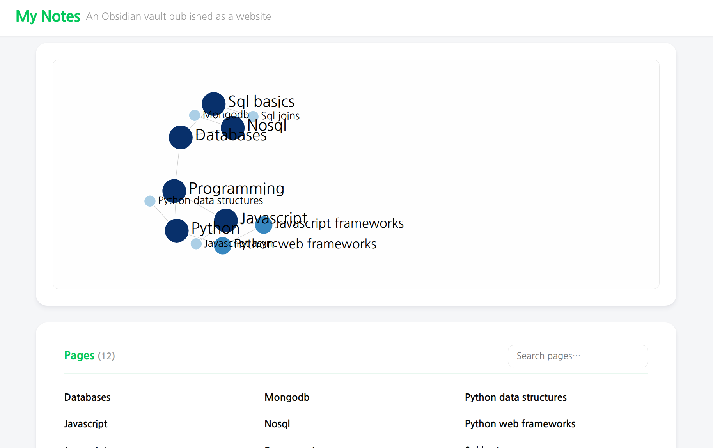

# Obsidian Site

A static site generator for [Obsidian](https://obsidian.md/) vaults. Converts your Markdown notes into a browsable website with an interactive link graph, wikilink navigation, and auto-generated backlinks.



## Quick Start

### Using the CLI

```bash
npx obsidian-site build --source /path/to/vault
```

Or install globally:

```bash
npm install -g obsidian-site
obsidian-site build --source /path/to/vault
```

This reads your vault, generates HTML pages, and writes them to `public/` (or the directory specified in `site.yaml`).

### Using the GitHub Action

```yaml
# .github/workflows/deploy.yml
name: Deploy to GitHub Pages

on:
  push:
    branches: [main]

permissions:
  pages: write
  id-token: write

jobs:
  deploy:
    runs-on: ubuntu-latest
    environment:
      name: github-pages
      url: ${{ steps.deploy.outputs.page_url }}
    steps:
      - uses: actions/checkout@v4
      - uses: benelog/obsidian-site@v1
      - uses: actions/upload-pages-artifact@v3
        with:
          path: public
      - id: deploy
        uses: actions/deploy-pages@v4
```

> **Note:** This workflow requires the repository's **Settings → Pages → Build and deployment → Source** to be set to **GitHub Actions**. For more details on the actions used above, see [Using custom workflows with GitHub Pages](https://docs.github.com/en/enterprise-cloud@latest/pages/getting-started-with-github-pages/using-custom-workflows-with-github-pages).

#### Action Inputs

| Input    | Default | Description                              |
|----------|---------|------------------------------------------|
| `source` | `.`     | Path to the Obsidian vault               |
| `output` |         | Output directory (overrides `site.yaml`) |

## Configuration

Create a `site.yaml` in your vault root:

```yaml
title: My Notes
subtitle: A collection of dev notes
lang: en
content-directory: content
output-directory: public
gitHub:
  repository-url: https://github.com/user/repo
  content-branch: main
```

| Key                 | Default              | Description                                          |
|---------------------|----------------------|------------------------------------------------------|
| `title`             | Directory name       | Site title shown in navigation                       |
| `subtitle`          | (empty)              | Subtitle shown on the index page                     |
| `lang`              | `en`                 | HTML `lang` attribute                                |
| `content-directory` | `content`            | Directory containing `.md` files (relative to vault) |
| `output-directory`  | `public`             | Build output directory (relative to vault)           |
| `gitHub`            |                      | GitHub integration settings                          |

Setting `gitHub.repository-url` and `gitHub.content-branch` adds an "Edit" link to each page that points to the source file on GitHub.

## CLI Reference

```
obsidian-site <command> [options]

Commands:
  build              Build the static site
  serve (server)     Build and start a local preview server

Options:
  --source <path>    Path to the Obsidian vault (default: current directory)
  --output <path>    Output directory (overrides site.yaml setting)
  --port <number>    Port for the preview server (default: 8000)
```

## How It Works

### Notes

- All `.md` files in the content directory (including nested subdirectories) become pages
- The filename becomes the page title (`spring-boot` -> "spring boot")
- Headings are downgraded by one level (`#` -> `##`, `##` -> `###`) since the filename is rendered as `<h1>`

### Wikilinks

- `[[target]]` links to `target.html` with display text derived from the filename
- `[[target|custom text]]` links to `target.html` with the specified display text
- Links to non-existent pages are rendered as strikethrough text

### Related & Backlinks

- A `## Related` section in your note is extracted and rendered in the sidebar
- Backlinks (pages that link to the current page) are automatically generated in the sidebar

### Tags

- Add tags via YAML frontmatter or inline `#tag` syntax in the body:
  ```yaml
  ---
  tags: [programming, web]
  ---
  ```
  ```markdown
  This note is about #javascript and #frontend development.
  ```
- Tags from both sources are merged and displayed as clickable pills on each page
- Clicking a tag navigates to the Tags page (`tags.html#tag-{name}`), which lists all pages grouped by tag

### Edit Link

If `gitHub.repository-url` and `gitHub.content-branch` are set in `site.yaml`, each page includes an "Edit" link that opens the source Markdown file directly on GitHub for editing.

### Local Graph

Each page displays a local graph in the sidebar, showing connections up to 2 levels deep from the current page.

### Custom Layouts and Styles

You can override the default HTML templates and CSS by placing files in your vault:

- `_layouts/page.html` — Custom template for individual pages
- `_layouts/index.html` — Custom template for the index page
- `_styles/style.css` — Custom stylesheet

Files in `_layouts/` and `_styles/` take precedence over the built-in defaults.

### Index Page

The index page includes:
- An interactive D3.js graph visualization of all note connections
- A searchable list of all pages

## Local Preview

```bash
npx obsidian-site serve --source /path/to/vault
```

## Template Repository

Use [obsidian Site Template](https://github.com/benelog/obsidian-site-template) to create a new site from scratch with a pre-configured GitHub Actions workflow. A live demo is available at https://benelog.github.io/obsidian-site-template.

## License

MIT
